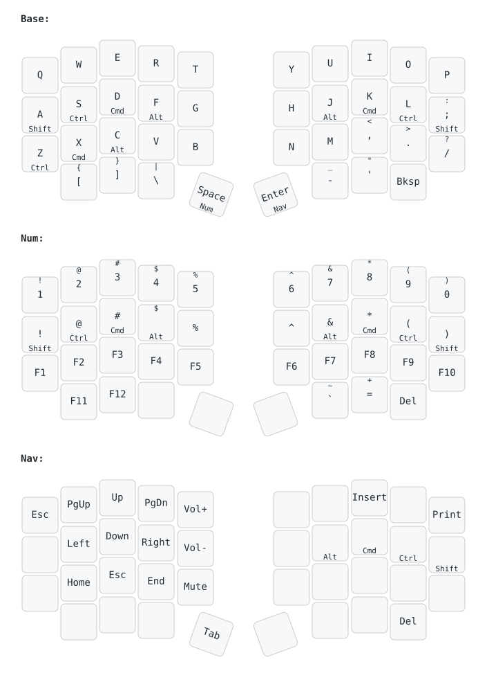

# Chicklet

The Chicklet is a staggered-column, split, low-profile keyboard with 38 keys.

Firmware is available in our [QMK fork](https://github.com/eggsworks/qmk_firmware/tree/chicklet-devel/keyboards/eggsworks/chicklet).

## Layout and keymap

The Chicklet began as an egg58 with 10 keys removed from each half. Thus, the layout is quite similar. Spacing between
keys has been tightened to nominal Choc (18x17mm) spacing, the pinky column stagger has been made more aggressive, the
thumb key has had its position adjusted, and the bottom row has shifted inwards.

This is the default keymap, but it is customizable.

## Materials

- 1 left PCB
- 1 right PCB
- 2 PCA9555PW I2C GPIO expanders, TSSOP-24
- 4 5.1k 0603 resistors
- 2 USB-C receptacles (GT-USB-7010ASV)
- 38 Choc sockets (CPG135001S30)
- 38 diodes (1N4148 or similar, SOD-123)
- 1 Seeed Xiao microcontroller (tested with RP2040)
- 1 left switchplate
- 1 right switchplate
- 8x each M2 screws, nuts, and 1mm spacers
- 1 USB-C cable
- 38 Choc switches (Choc V1 only)

## Build instructions

First, assemble all surface-mount components on the backs of the boards.

Then, assemble each half by attaching the switchplate to the PCB with four M2 screws. Use a spacer in between.

Finally, insert switches, being careful to support sockets from the back during insertion.

Connect the two halves with USB-C, connect the Xiao to a PC, and flash the firmware.

## Firmware

Firmware will be released soon. There are plans to support both QMK and ZMK.

## Accessories

The Chicklet supports mounting with a Tenting Puck from splitkb.com.

It also includes pads for Sidecar - a modular system intended to support encoders, OLEDs, trackpads, or other peripherals. These solderless modules
mount to the inner edges of each half, make contact via pogo pins, and communicate via I2C. No modules are released yet, but stay tuned.

## Changelog

### Revision 1 - 2023-11-24

- Initial release

## License

This repository is available under the terms of the [GPL, verison 3](LICENSE).

Some portions are derived from:

- [keyswitches.pretty](https://github.com/daprice/keyswitches.pretty) ([CC BY-SA 4.0](https://creativecommons.org/licenses/by-sa/4.0/))
- [Keebio-Parts.pretty](https://github.com/keebio/Keebio-Parts.pretty) ([MIT](https://github.com/keebio/Keebio-Parts.pretty/blob/master/LICENSE))
- [SofleKeyboard](https://github.com/josefadamcik/SofleKeyboard) ([MIT](https://github.com/josefadamcik/SofleKeyboard/blob/master/LICENSE))
- [kleeb](https://github.com/crides/kleeb/) ([MIT](https://github.com/crides/kleeb/blob/master/LICENSE))
